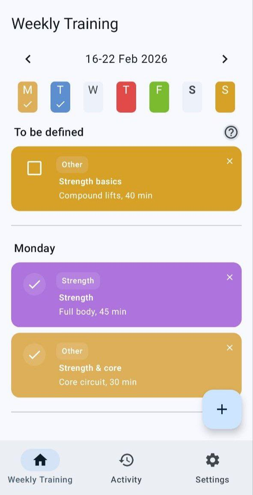
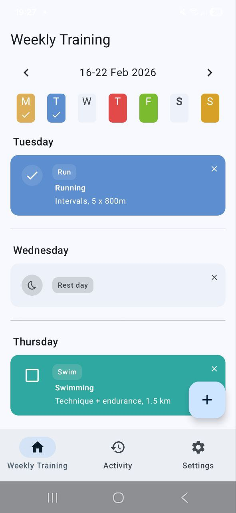
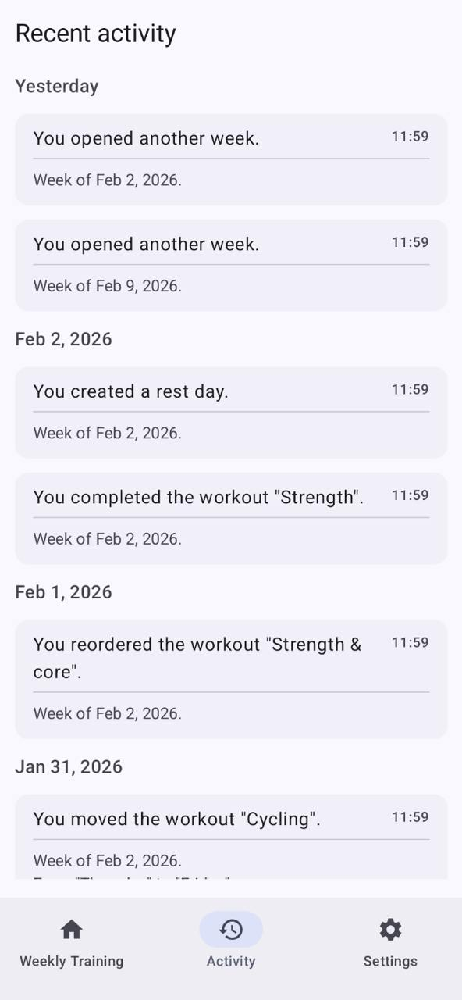
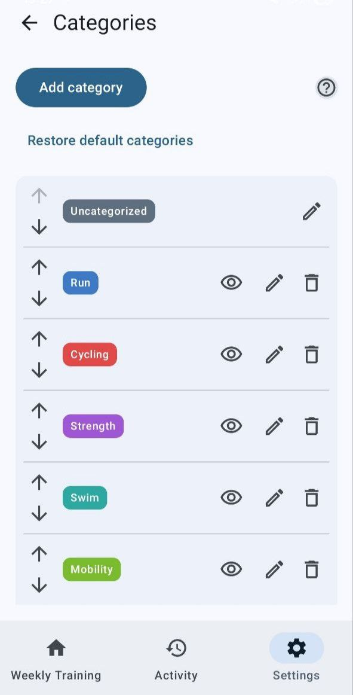
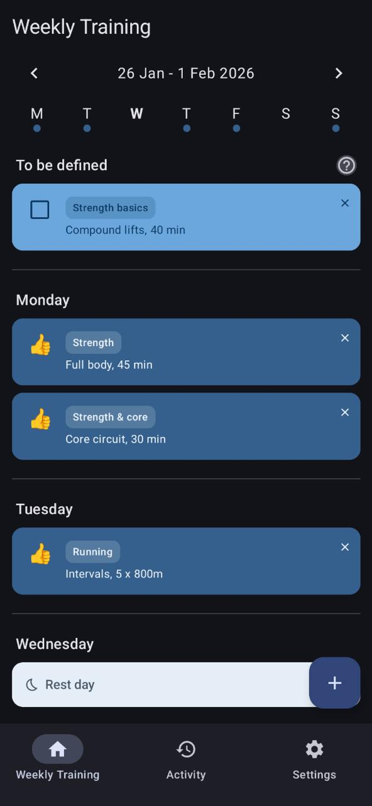
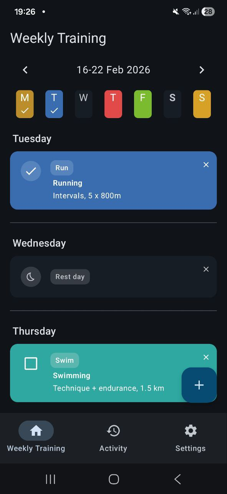
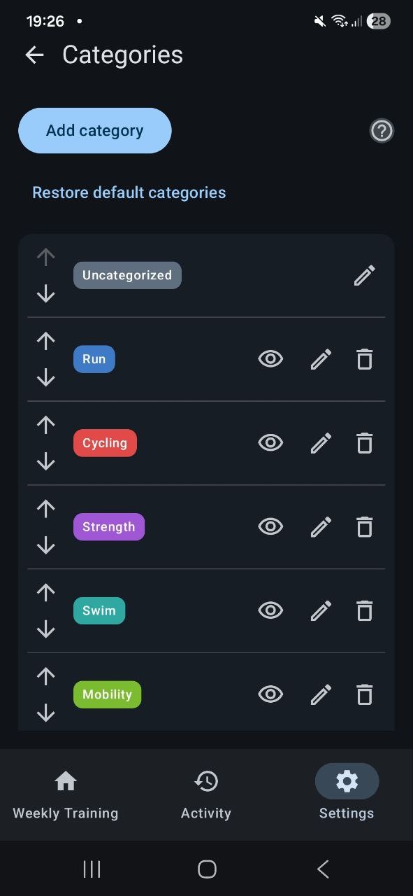
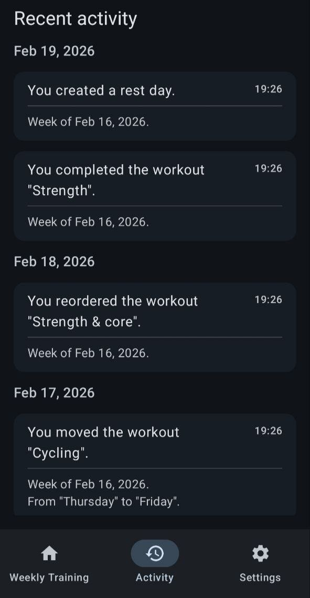

---

# 🪽 Hermes

  

**Hermes** is a simple, offline-first **weekly training planner** — built to help you plan the week and keep it adaptable.

Like **Hermes, the messenger god** 🪽, it’s made for movement: workouts can be reordered, rescheduled and rearranged as the week changes — and organized with categories that match your routine.

It focuses on clarity and consistency, with a lightweight weekly view that embraces one idea:

> **“Plan the week. Life happens. Adjust.”**

No noise. No pressure. Just a realistic plan you can keep reshaping as life happens.

  

---

## ✨ Features

- Weekly-based training view (calendar-style, but lighter)
- Plan sessions by day of the week
- Organize workouts with categories (create, edit, reorder, hide, restore defaults) with color support
- A **“To be defined”** area for sessions not assigned yet
- Drag & drop to **reschedule** sessions between days
- Backup support: export/import your data, choose a default backup folder in Settings and clear it anytime
- Choose week start day in Settings (any day, Monday through Sunday)
- Weekly header summary with progress and week completion feedback
- Activity history filters by type, category and week
- Trophy families, overview/detail screens and celebration banners
- Events screen for upcoming races and other non-workout planning moments
- Mark days or sessions as:
  - **Training**
  - **Rest day**
- Simple visual states:
  - Planned
  - Completed
  - Rest
- Light & dark themes
- Language support:
  - English (default)
  - Portuguese (Brazil)
  - Deutsch
  - Français
  - Español
  - Italiano
  - العربية
  - हिन्दी
  - 日本語
- Offline-first — no account, no server, no noise

---

## 🖼️ Screenshots

A quick look at Hermes in action — focused on clarity and flexibility.

### ☀️ Light mode

  
  
  
  

### 🌙 Dark mode

  
  
  
  

---

## 🧠 Design philosophy

Hermes avoids the “hardcore fitness app” vibe.

No:
- aggressive charts
- heavy gamification pressure
- constant performance comparison

Instead, the focus is on:
- **weekly planning**
- **easy rescheduling**
- **visual clarity**
- **calm interaction**
- **rest days as first-class citizens**

This is a tool meant to support training — not judge it. Hermes includes gentle, optional recognition and it stays calm and supportive.

---

## 🛠️ Tech stack

- **Kotlin + Android** – Single-platform app
- **Jetpack Compose + Material 3** – Declarative UI
- **Room** – Local persistence
- **DataStore (Preferences)** – Theme, language and settings
- **Hilt** – Dependency injection
- **Coroutines + Flow + StateFlow** – Async and reactive streams
- **Detekt + Ktlint** – Static analysis and formatting
- **GitHub Actions** – CI for build, lint and releases

---

## 🗺️ Ideas for the future

Some things on the radar (not guaranteed):

- Weekly summaries (planned vs completed)
- Notes + perceived effort
- Training templates / reusable routines
- Shareable weekly report (coach-friendly)
- Subtle animations and micro-interactions
- Soft streaks or other light-touch recognition
- Fun yearly comparisons (“you ran X km — that’s like crossing Y”)

---

## 🚫 Contributing

Contributions are not open at the moment. This is a personal playground. 
But forks, ideas and feedback are always welcome.

---

## 📄 License

This project is licensed under the [Apache 2.0 License](LICENSE).
