

---

# 🪽 Hermes

  

**Hermes** is a calm, offline-first **training planner and progress companion** — built to help you shape the week, adapt when life moves, and keep long-running goals visible without turning training into noise.

Like **Hermes, the messenger god** 🪽, it’s made for movement: workouts can be reordered, rescheduled and rearranged as the week changes, while events, challenges, personal records and progress stay connected to the same local training story.

It focuses on clarity and consistency, with one practical idea at the center:

> **“Plan the week. Life happens. Adjust.”**

No account. No server. No pressure. Just a realistic plan you can keep reshaping as life happens.

  

---

## ✨ Features

### Plan the week
- Weekly training board with a calendar-like rhythm and lighter planning flow
- Drag & drop workouts between days, slots and the **“To be defined”** area
- Training, rest, busy, sick and race-event planning states
- Categories with colors, ordering, hiding and restore-default support
- Configurable week start day

### Track progress
- Progress overview with weekly readouts, training mix, activity preview and next-focus guidance
- Activity history with filters by type, category and week
- Trophy families with overview/detail screens and celebration feedback

### Prepare goals and events
- Events screen for races and other non-workout planning moments
- Challenges with daily or total goals, pacing guidance, progress history and completion celebrations
- Personal Records with customizable series, result history and best-result tracking
- Pace calculator for pace, time and distance

### Own your data
- Offline-first local storage with no account and no server
- JSON backup export/import
- Default backup folder selection in Settings

### Personalize the app
- Light, dark and Material You color options
- Configurable distance, pace and weight units
- App language support:
  - English (default)
  - Portuguese (Brazil)
  - Deutsch
  - Français
  - Español
  - Italiano
  - العربية
  - हिन्दी
  - 日本語

---

## 🖼️ Screenshots

A quick look at Hermes in action — focused on clarity and flexibility.

### ☀️ Light mode

  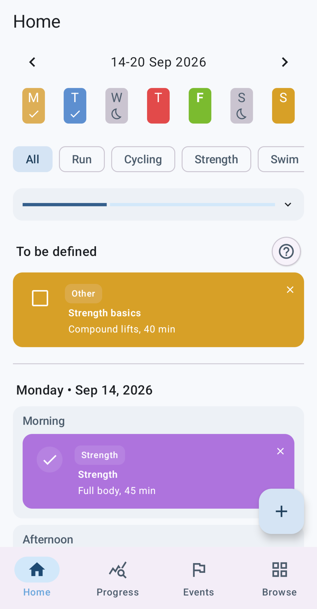
  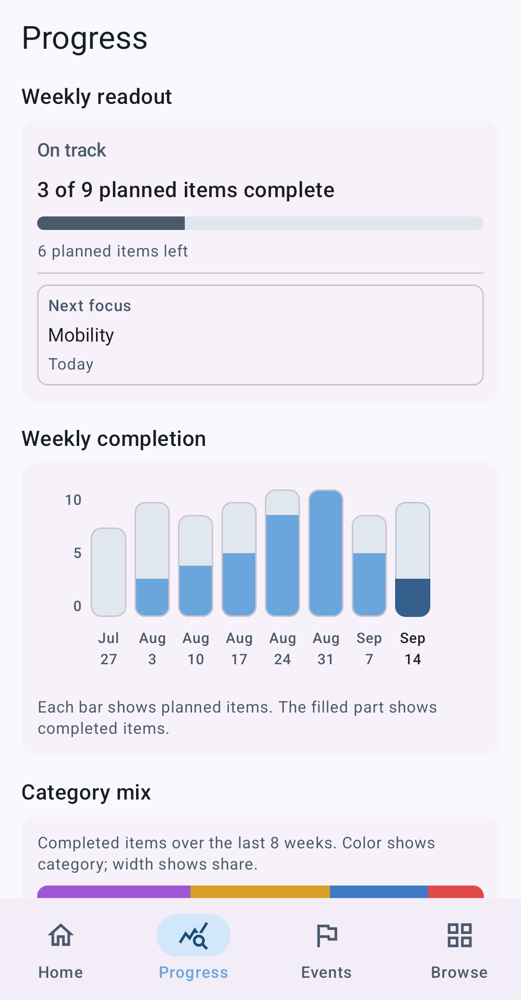

  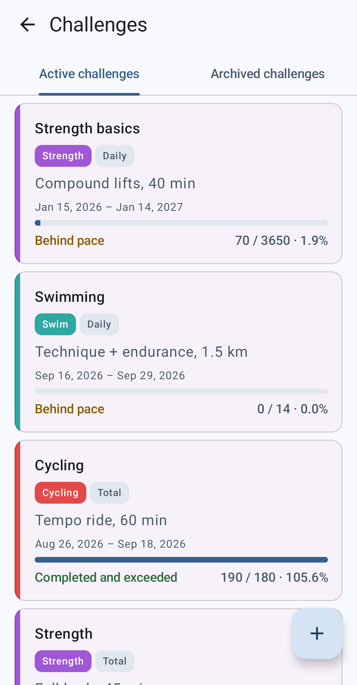
  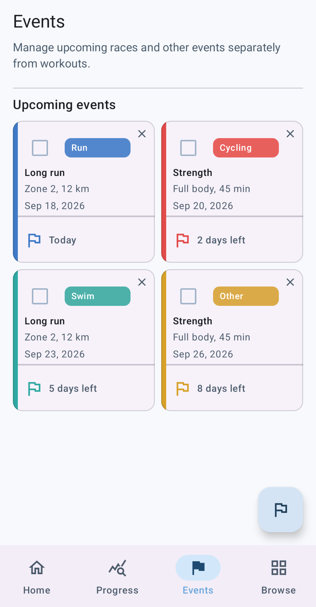

  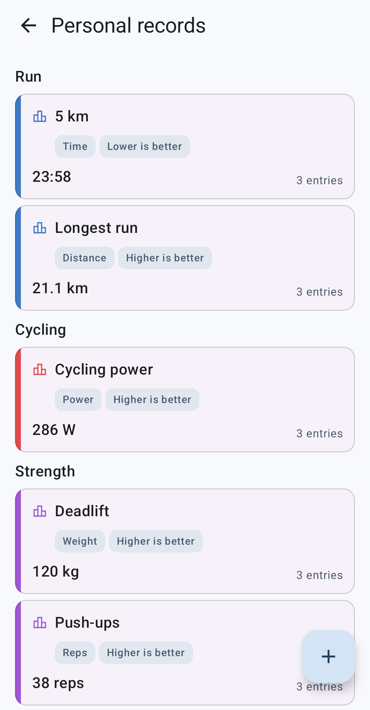
  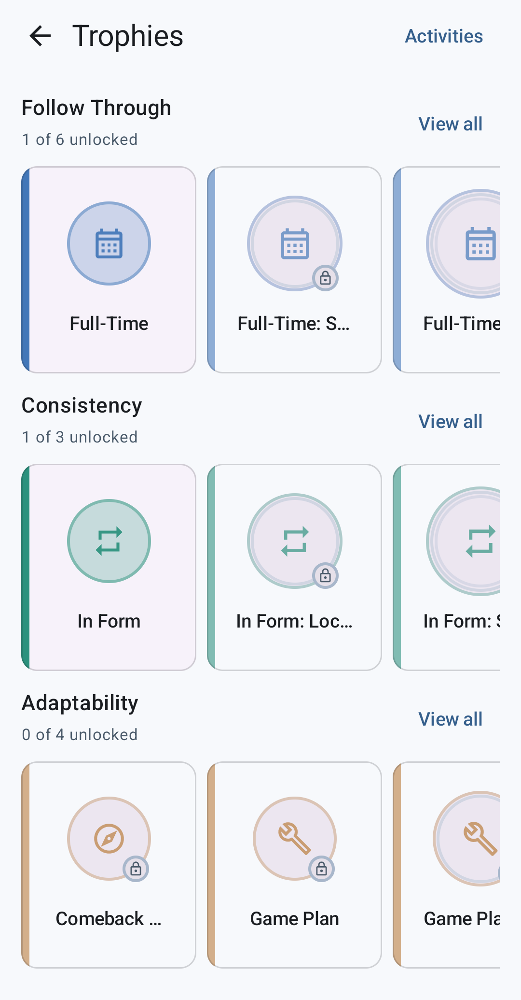

### 🌙 Dark mode

  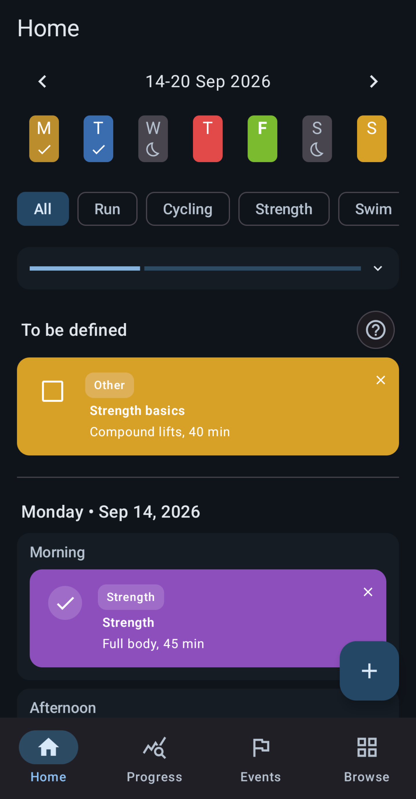
  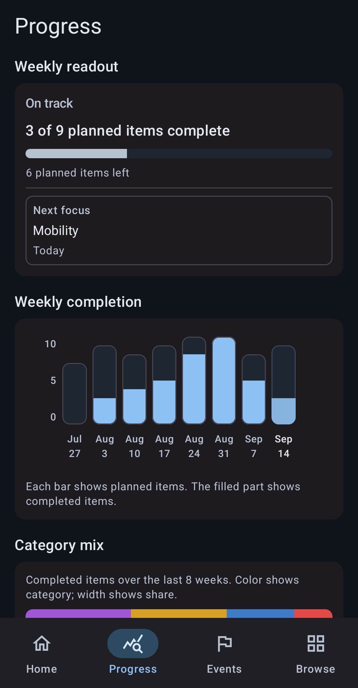

  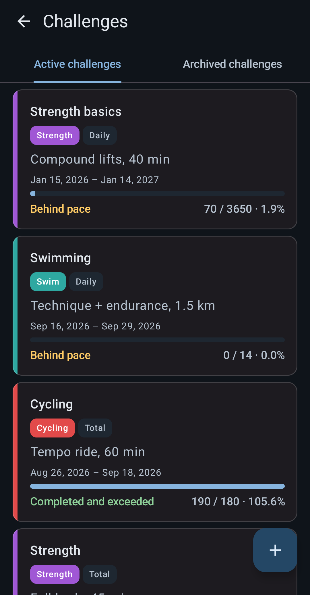
  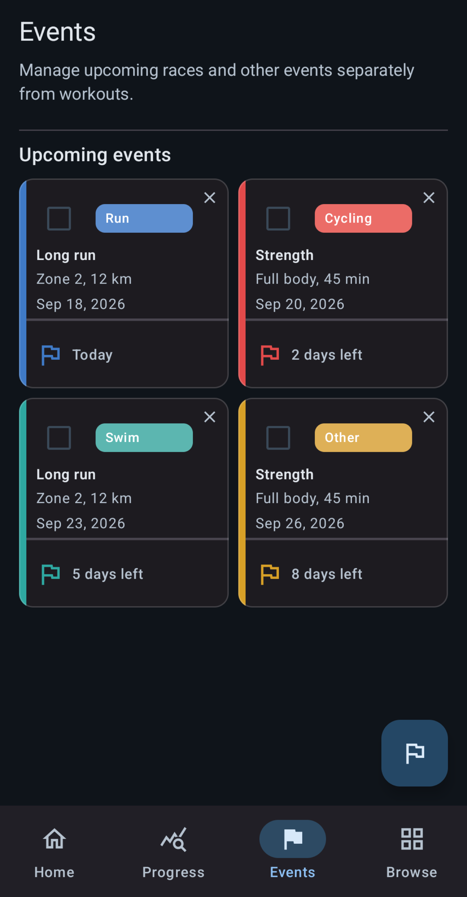

  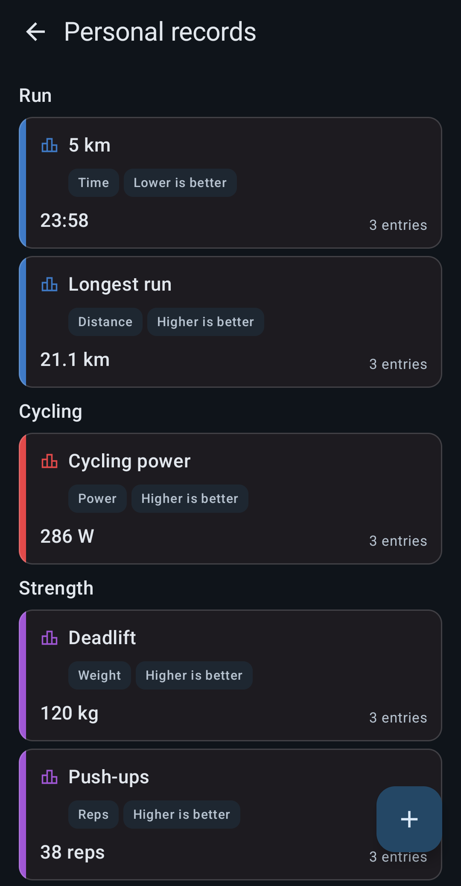
  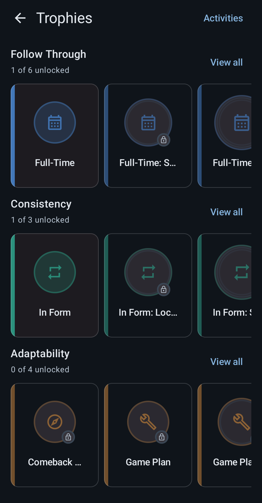

---

## 🧠 Design philosophy

Hermes avoids the “hardcore fitness app” vibe.

No:
- aggressive charts
- heavy gamification pressure
- constant performance comparison

Instead, the focus is on:
- **weekly planning**
- **easy rescheduling**
- **visual clarity**
- **calm interaction**
- **rest days as first-class citizens**
- **progress without punishment**

This is a tool meant to support training — not judge it. Hermes includes gentle, optional recognition, but the app stays quiet enough to be useful on ordinary weeks too.

---

## 🛠️ Tech stack

- **Kotlin + Android** – Single-platform app
- **Jetpack Compose + Material 3** – Declarative UI and adaptive navigation
- **Room** – Local persistence
- **DataStore (Preferences)** – Theme, language, units and settings
- **AppCompat locales** – In-app language selection
- **Hilt** – Dependency injection
- **Coroutines + Flow + StateFlow** – Async and reactive streams
- **Detekt + Ktlint** – Static analysis and formatting
- **GitHub Actions** – CI for build, lint and releases

---

## 🚫 Contributing

Contributions are not open at the moment. This is a personal playground. 
But forks, ideas and feedback are always welcome.

---

## 📄 License

This project is licensed under the [Apache 2.0 License](LICENSE).
