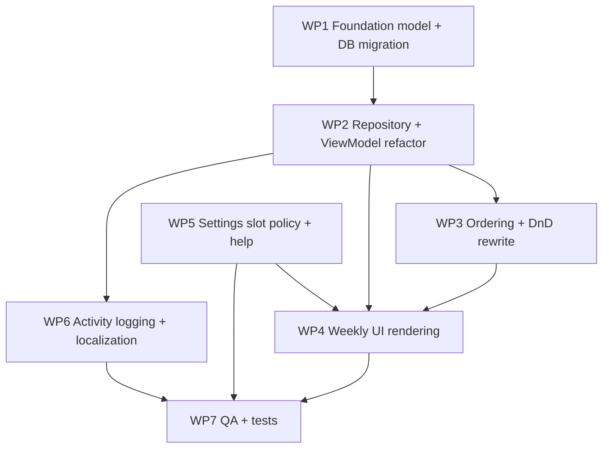

# SPEC — Weekly Events + Turnos (Morning/Afternoon/Night)

## 1. Goal
Evolve Weekly Training into a flexible planner where a day can contain mixed event types with optional turnos (time slots), while preserving current behavior for users that keep one item per day.

This is scoped as a **single release**.

## 2. Current Baseline (from `main`)
This spec is aligned with the current codebase baseline:
- Weekly items are still modeled as `Workout` + `isRestDay`.
- Workouts already support categories (`categoryId`, category name/color mapping in UI).
- Settings uses inner routes via `SettingsRoute` (`MAIN`, `THEME`, `LANGUAGE`, `CATEGORIES`).
- Database is already at version `2` and includes `MIGRATION_1_2` (categories + `workouts.categoryId`).
- Weekly strings follow `weekly_training_*` and `workout_dialog_*` naming.
- Weekly drag/drop is section-based (`To be defined` + weekday sections).

## 3. Locked Product Decisions
- Event nomenclature: `workout`, `rest`, `busy`, `sick`.
- Avoid "rest day/busy day/sick day" as model naming for new structures.
- Turnos: `morning`, `afternoon`, `night`.
- Slot mode default behavior: auto-enable when a day has **2+ events**.
- Add Settings configuration for this behavior.
- Add an inner Settings screen for slot behavior plus `?` explanation entry.
- Reuse existing Settings card visual language (surface/shape/elevation pattern).

## 4. UX Specification

### 4.1 Weekly screen behavior
- Day with 0–1 item: keep current compact/simple behavior.
- Day with 2+ items and policy `AUTO_WHEN_MULTIPLE`: show slot groups:
  - Morning
  - Afternoon
  - Night
- If policy is `ALWAYS_SHOW` (if included): always render slot groups for every day.

### 4.2 Event semantics
- `workout`: completable.
- `rest`, `busy`, `sick`: non-completable.
- Mixed combinations in same day are valid (example: busy morning + workout afternoon + rest night).

### 4.3 Add flow
- Keep current FAB menu pattern.
- Replace single non-workout action with explicit actions:
  - Add workout
  - Add rest
  - Add busy
  - Add sick
- Workout creation continues using existing dialog flow (type/description/category picker).
- Non-workout creation should be quick-add; optional details can be edited later.

### 4.4 Edit flow
- Keep workout edit flow compatible with existing `AddWorkoutDialog`/draft logic.
- Non-workout edit supports changing:
  - event type (optional conversion UX)
  - description/note (if allowed)
  - slot

### 4.5 Help UX
- Add `?` affordance in the new slot-settings screen.
- Help content explains:
  - when slot mode appears
  - how drag/drop between slots works
  - that non-workout events are non-completable

## 5. Architecture & Model Changes

### 5.1 Replace boolean rest model
Current model (`Workout`, `WorkoutUi`, `WorkoutEntity`) uses `isRestDay`.

Target model:
- `eventType: EventType`
  - `WORKOUT`
  - `REST`
  - `BUSY`
  - `SICK`
- `timeSlot: TimeSlot?`
  - `MORNING`
  - `AFTERNOON`
  - `NIGHT`

Keep existing fields including category support:
- `categoryId` remains relevant for `WORKOUT`.
- Non-workout events must not carry workout category assignment.

### 5.2 Rules
- Completion updates are ignored for non-`WORKOUT` types.
- Ordering key changes from `(dayOfWeek, order)` to `(dayOfWeek, timeSlot, order)` when slot UI is active.
- `timeSlot = null` remains allowed for migration/backward compatibility until reassigned.

## 6. Persistence, DB, and Migration

### 6.1 Schema target
`workouts` table currently contains `isRestDay` and `categoryId`.

Add:
- `eventType` (`TEXT` recommended)
- `timeSlot` (`TEXT`, nullable)

Deprecate:
- `isRestDay` (can be retained temporarily during migration safety window, but app logic should migrate to `eventType`).

### 6.2 Database versioning
- Current DB version is `2`.
- Add a new migration path from `2` to next version (e.g., `MIGRATION_2_3`).
- Existing `MIGRATION_1_2` remains registered.

### 6.3 Migration mapping
- `isRestDay = 1` -> `eventType = REST`
- `isRestDay = 0` -> `eventType = WORKOUT`
- `timeSlot = NULL`
- Preserve `categoryId` as-is (for workouts only).

### 6.4 Repository and DAO impact
Update repository/DAO contracts that currently receive `isRestDay`:
- `WeeklyTrainingRepository.updateWorkoutDetails(...)`
- `WorkoutDao.updateDetails(...)`
- Related mapping and copy/replace logic.

## 7. Settings Integration

### 7.1 New settings policy
Add policy enum persisted in DataStore (same settings store used for theme/language):
- `AUTO_WHEN_MULTIPLE` (default)
- `ALWAYS_SHOW` (optional but recommended now for extensibility)

### 7.2 Settings route additions
Extend `SettingsRoute` with new route(s):
- `SLOT_MODE`
- Optional `SLOT_MODE_HELP` if help is a full screen (dialog is acceptable).

### 7.3 Main settings entry
Add a new section/row on main settings screen:
- Section: Planning
- Row: Slot mode

Use existing settings UI patterns (`SettingsSection`, card surface style).

## 8. Weekly UI and DnD Impact

### 8.1 Section model
Current weekly section model is:
- To be defined
- Monday..Sunday

Target section model extends each day with optional sub-sections for slots when policy + day conditions apply.

### 8.2 Drag/drop target
Drop target must include:
- day
- slot
- index/order

### 8.3 Ordering helper rewrite
Current helper `updateWorkoutOrderWithRestDayRules` enforces rest/workout exclusivity by pushing one item out.

Replace with slot-aware ordering behavior:
- no forced ejection based on type
- normalize source + destination slot buckets

### 8.4 Calendar indicator
Current header uses `WorkoutDayIndicator` derived from last item + completion state.

Target indicator logic should be explicit by event type mix and workout completion status, not tied to the old rest boolean assumptions.

## 9. Categories Compatibility
Because categories were recently introduced, this feature must not regress category behavior:
- Workout categories continue to work unchanged.
- Non-workout events should ignore/clear category assignment.
- Weekly dialog draft + "manage categories" navigation flow must stay intact for workouts.
- Activity metadata keys for category name changes remain for workout actions.

## 10. User Action Logging & Activity

### 10.1 Action model
Current user actions include rest-day-specific action types.

Add new action types for new non-workout events (`busy`, `sick`) and slot changes.
Suggested families:
- create/update/delete/undo for busy/sick
- convert between workout/rest/busy/sick (if conversion UI is shipped)
- move/reorder metadata includes slot info

### 10.2 Metadata keys
Add metadata keys for slot/type transitions, e.g.:
- `old_event_type`, `new_event_type`
- `old_time_slot`, `new_time_slot`

Retain current week/day/order/type/description/category metadata where applicable.

### 10.3 Activity formatter and strings
Update formatter mappings and all localized `values-*` strings for new action labels so feed does not fall back.

## 11. Undo and Copy-Week Behavior
- Undo snapshots must include `eventType` + `timeSlot`.
- Copy last week must copy event type and slot values.
- Reorder/normalize behavior after undo/delete remains stable under slot buckets.

## 12. File Impact Map (updated)

### Weekly Training
- `/Users/rafaelcordeiro/AndroidStudioProjects/hermes/app/src/main/java/com/rafaelfelipeac/hermes/features/weeklytraining/domain/model/Workout.kt`
- `/Users/rafaelcordeiro/AndroidStudioProjects/hermes/app/src/main/java/com/rafaelfelipeac/hermes/features/weeklytraining/domain/model/AddWorkoutRequest.kt`
- `/Users/rafaelcordeiro/AndroidStudioProjects/hermes/app/src/main/java/com/rafaelfelipeac/hermes/features/weeklytraining/presentation/model/WorkoutUi.kt`
- `/Users/rafaelcordeiro/AndroidStudioProjects/hermes/app/src/main/java/com/rafaelfelipeac/hermes/features/weeklytraining/presentation/model/WorkoutDayIndicator.kt`
- `/Users/rafaelcordeiro/AndroidStudioProjects/hermes/app/src/main/java/com/rafaelfelipeac/hermes/features/weeklytraining/data/local/WorkoutEntity.kt`
- `/Users/rafaelcordeiro/AndroidStudioProjects/hermes/app/src/main/java/com/rafaelfelipeac/hermes/features/weeklytraining/data/local/WorkoutDao.kt`
- `/Users/rafaelcordeiro/AndroidStudioProjects/hermes/app/src/main/java/com/rafaelfelipeac/hermes/features/weeklytraining/data/WeeklyTrainingRepositoryImpl.kt`
- `/Users/rafaelcordeiro/AndroidStudioProjects/hermes/app/src/main/java/com/rafaelfelipeac/hermes/features/weeklytraining/domain/repository/WeeklyTrainingRepository.kt`
- `/Users/rafaelcordeiro/AndroidStudioProjects/hermes/app/src/main/java/com/rafaelfelipeac/hermes/features/weeklytraining/domain/WorkoutOrdering.kt`
- `/Users/rafaelcordeiro/AndroidStudioProjects/hermes/app/src/main/java/com/rafaelfelipeac/hermes/features/weeklytraining/presentation/WeeklyTrainingViewModel.kt`
- `/Users/rafaelcordeiro/AndroidStudioProjects/hermes/app/src/main/java/com/rafaelfelipeac/hermes/features/weeklytraining/presentation/WeeklyTrainingViewModelHelpers.kt`
- `/Users/rafaelcordeiro/AndroidStudioProjects/hermes/app/src/main/java/com/rafaelfelipeac/hermes/core/ui/components/calendar/weeklytraining/WeeklyTrainingContent.kt`
- `/Users/rafaelcordeiro/AndroidStudioProjects/hermes/app/src/main/java/com/rafaelfelipeac/hermes/core/ui/components/calendar/weeklytraining/WeeklyTrainingDragDrop.kt`
- `/Users/rafaelcordeiro/AndroidStudioProjects/hermes/app/src/main/java/com/rafaelfelipeac/hermes/core/ui/components/calendar/weeklytraining/WeeklyTrainingRow.kt`
- `/Users/rafaelcordeiro/AndroidStudioProjects/hermes/app/src/main/java/com/rafaelfelipeac/hermes/features/weeklytraining/presentation/WeeklyTrainingState.kt`
- `/Users/rafaelcordeiro/AndroidStudioProjects/hermes/app/src/main/java/com/rafaelfelipeac/hermes/core/ui/components/calendar/WeeklyCalendarHeader.kt`

### Settings
- `/Users/rafaelcordeiro/AndroidStudioProjects/hermes/app/src/main/java/com/rafaelfelipeac/hermes/features/settings/presentation/SettingsRoute.kt`
- `/Users/rafaelcordeiro/AndroidStudioProjects/hermes/app/src/main/java/com/rafaelfelipeac/hermes/features/settings/presentation/SettingsScreen.kt`
- `/Users/rafaelcordeiro/AndroidStudioProjects/hermes/app/src/main/java/com/rafaelfelipeac/hermes/features/settings/presentation/SettingsState.kt`
- `/Users/rafaelcordeiro/AndroidStudioProjects/hermes/app/src/main/java/com/rafaelfelipeac/hermes/features/settings/presentation/SettingsViewModel.kt`
- `/Users/rafaelcordeiro/AndroidStudioProjects/hermes/app/src/main/java/com/rafaelfelipeac/hermes/features/settings/domain/repository/SettingsRepository.kt`
- `/Users/rafaelcordeiro/AndroidStudioProjects/hermes/app/src/main/java/com/rafaelfelipeac/hermes/features/settings/data/SettingsDataStore.kt`
- `/Users/rafaelcordeiro/AndroidStudioProjects/hermes/app/src/main/java/com/rafaelfelipeac/hermes/features/settings/data/SettingsRepositoryImpl.kt`

### App navigation integration
- `/Users/rafaelcordeiro/AndroidStudioProjects/hermes/app/src/main/java/com/rafaelfelipeac/hermes/features/app/HermesAppContent.kt`

### Activity / logging
- `/Users/rafaelcordeiro/AndroidStudioProjects/hermes/app/src/main/java/com/rafaelfelipeac/hermes/core/useraction/model/UserActionType.kt`
- `/Users/rafaelcordeiro/AndroidStudioProjects/hermes/app/src/main/java/com/rafaelfelipeac/hermes/core/useraction/model/UserActionEntityType.kt`
- `/Users/rafaelcordeiro/AndroidStudioProjects/hermes/app/src/main/java/com/rafaelfelipeac/hermes/core/useraction/metadata/UserActionMetadataKeys.kt`
- `/Users/rafaelcordeiro/AndroidStudioProjects/hermes/app/src/main/java/com/rafaelfelipeac/hermes/features/activity/presentation/formatter/ActivityUiFormatter.kt`
- Localized files: `/Users/rafaelcordeiro/AndroidStudioProjects/hermes/app/src/main/res/values*/strings.xml`

### DB
- `/Users/rafaelcordeiro/AndroidStudioProjects/hermes/app/src/main/java/com/rafaelfelipeac/hermes/core/database/HermesDatabase.kt`
- `/Users/rafaelcordeiro/AndroidStudioProjects/hermes/app/src/main/java/com/rafaelfelipeac/hermes/core/database/Migrations.kt`
- `/Users/rafaelcordeiro/AndroidStudioProjects/hermes/app/src/main/java/com/rafaelfelipeac/hermes/core/di/DatabaseModule.kt`

## 13. Acceptance Criteria
- Users can create `workout`, `rest`, `busy`, `sick`.
- Slot UI appears automatically for days with 2+ events under default policy.
- Slot policy is configurable from a new inner Settings screen.
- Help `?` explains slots and behavior.
- Drag/drop works across day + slot + order.
- Non-workout events cannot be completed.
- Category behavior for workouts remains intact.
- Activity feed has explicit localized labels for new actions.
- Existing installs migrate from DB v2 without data loss.
- Copy week + undo preserve event type and slot information.

## 14. Test Scope

### Unit
- entity/domain/ui mappings with `eventType` + `timeSlot` + category behavior.
- ordering and normalization across slot buckets.
- completion guard for non-workout.
- settings policy default + updates.

### Compose/instrumented
- slot UI visibility when day reaches 2+ events in auto mode.
- drag/drop between slots.
- settings navigation to slot mode screen and help UI.
- workout category flow remains functional after model changes.

### Migration
- migration test from v2 schema/data to new schema.
- ensure old `isRestDay` rows map correctly.

## 15. Risks
- Highest risk: slot-aware drag/drop and order normalization.
- High risk: migration correctness while preserving categories.
- Medium risk: localization volume for new action strings.

## 16. Open Decisions (confirm before implementation)
- Ship both `AUTO_WHEN_MULTIPLE` and `ALWAYS_SHOW` now, or only auto in this release?
- Non-workout detail model: fixed labels only vs optional custom note/title?
- Should slot selection be required during create when day already has slot mode enabled?

## 17. Implementation Order (Single Release)

### 17.1 Work packages
1. **WP1 — Foundation model + storage**
- Add `EventType` and `TimeSlot` model types.
- Update `Workout`, `WorkoutUi`, `WorkoutEntity` mappings.
- Add DB migration `2 -> 3` for `eventType/timeSlot`.
- Register migration in `DatabaseModule` and bump DB version.

2. **WP2 — Repository + ViewModel contract refactor**
- Replace `isRestDay` parameters with `eventType` in repository/DAO/update paths.
- Update add/update/delete/copy/undo logic to persist and restore slot/type.
- Keep category rules: categories only for workout-type items.

3. **WP3 — Ordering + drag/drop engine rewrite**
- Replace `updateWorkoutOrderWithRestDayRules` with slot-aware ordering.
- Extend drop context to include slot target.
- Normalize order inside `(day, slot)` buckets.

4. **WP4 — Weekly UI rendering**
- Add event-type rendering branches (`workout/rest/busy/sick`).
- Add slot sections in weekly content when policy says visible.
- Keep simple mode when day has <=1 item in auto policy.

5. **WP5 — Settings integration**
- Add slot policy to DataStore + repository + state/viewmodel.
- Add `SettingsRoute.SLOT_MODE` (and optional help route/dialog).
- Add Planning section + row + `?` explanation UI.

6. **WP6 — Activity logging + metadata + localization**
- Add `UserActionType` entries for busy/sick and slot transitions.
- Add metadata keys for event/slot old/new values.
- Update `ActivityUiFormatter` mappings.
- Add localized strings for all `values-*` locales.

7. **WP7 — QA hardening + tests**
- Unit, UI, and migration tests from section 14.
- Validate copy-week + undo with mixed slot/event-type data.
- Validate category flows still pass.

### 17.2 Dependency graph

### 17.3 Recommended implementation sequence
1. Complete **WP1 + WP2** in a compile-green state before touching UI behavior.
2. Implement **WP3** and validate ordering with focused unit tests.
3. Implement **WP5** (settings policy contract) before slot UI conditions.
4. Implement **WP4** with policy-aware UI switching.
5. Implement **WP6** once event/slot model is stable.
6. Finish with **WP7** full regression.

### 17.4 Definition of done by package
- **WP1 done**: app starts on upgraded DB with migrated old rows and no data loss.
- **WP2 done**: no `isRestDay`-driven domain branching remains in updated paths.
- **WP3 done**: move/reorder works across day+slot without duplicate order indexes.
- **WP4 done**: slot UI appears exactly per policy and day cardinality.
- **WP5 done**: settings route persists policy and help entry is reachable.
- **WP6 done**: activity feed has explicit titles/subtitles for new actions in all locales.
- **WP7 done**: tests pass and no regressions in categories/copy/undo flows.

### 17.5 Parallelization notes
- Safe to run in parallel:
  - WP5 (Settings) alongside WP3 (Ordering)
  - early localization scaffolding in WP6 after action names are finalized
- Must stay sequential:
  - WP1 before WP2/WP3/WP4
  - WP2 before WP4/WP6
